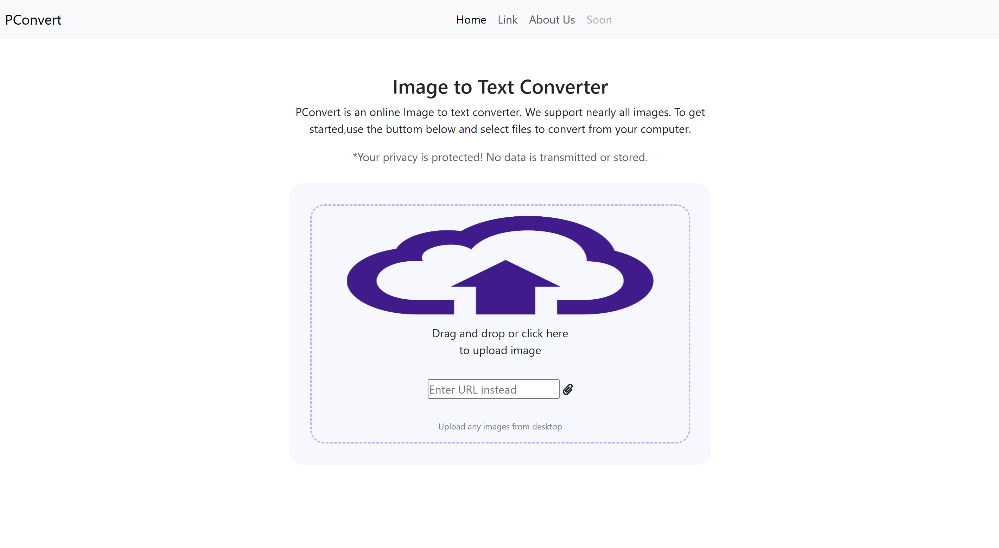
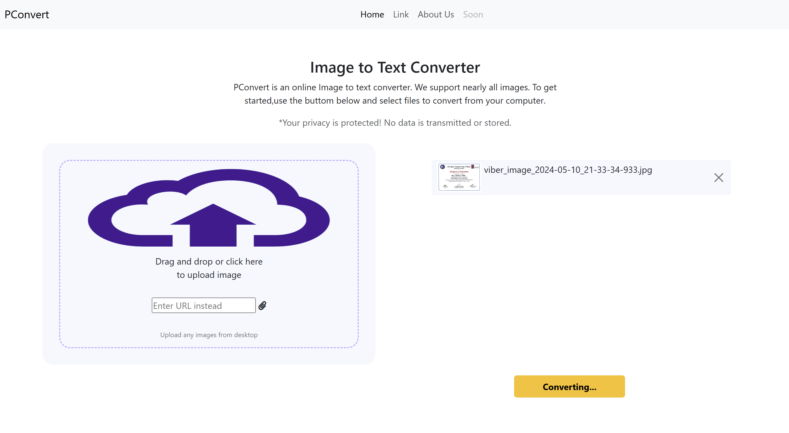
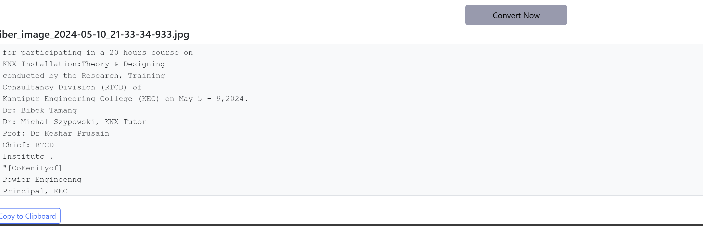

# Image-to-Text Converter

This is a Flask-based web application that allows users to upload images and extract text using OCR (Optical Character Recognition) powered by EasyOCR. It's a simple and easy-to-use tool for converting images to text.

## Features:
- Extracts text from images using EasyOCR.
- Simple and responsive design built with Flask and Bootstrap.
- View and copy the extracted text in a readable format.

## Screenshots:
- 
- 
- 

## Usage:
- Clone this repository to your local machine.
- Install the required dependencies using `pip install -r requirements.txt`.

## Notes:
Production Link : [Visit Production](https://web-production-faca.up.railway.app/)
- **Important**: The production version of this project might not work efficiently due to **Out of Memory (OOM)** issues, especially when processing large images. It's recommended to run this project locally for the best experience.
  
